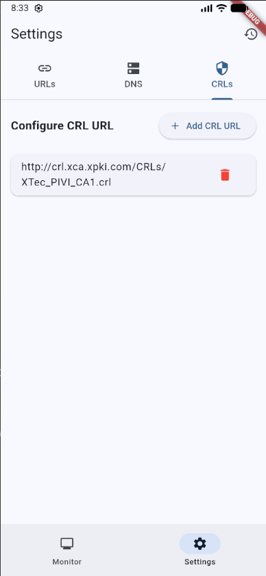
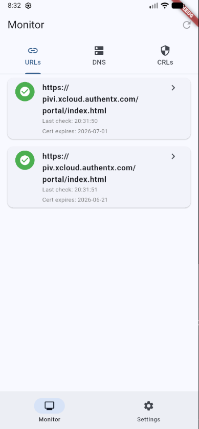
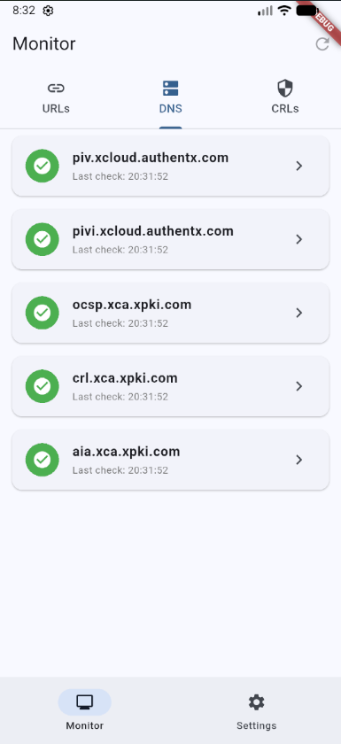
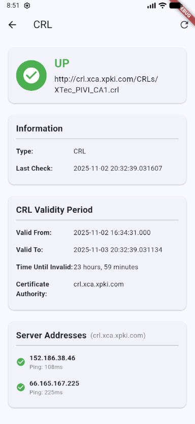
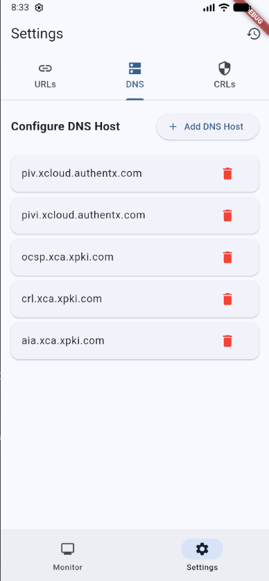

# Monitor v2 - Flutter Network Monitoring App

A comprehensive Flutter network monitoring application that checks the availability and status of URLs, DNS hosts, and Certificate Revocation Lists (CRLs). The app provides real-time monitoring with certificate expiry warnings and detailed status information.

## Features

### 🎯 Core Monitoring

* **URL Monitoring**: Check HTTP/HTTPS endpoint availability
* **DNS Resolution**: Verify DNS hostname resolution
* **CRL Verification**: Validate Certificate Revocation List availability and integrity
* **Certificate Tracking**: Monitor SSL certificate validity and expiry dates
* **Expiry Warnings**: Alert when certificates are expiring within 30 days

### 📱 User Interface

* **Material Design 3**: Modern, responsive UI with Material Components
* **Bottom Navigation**: Easy access to Monitor and Settings screens
* **Tab Navigation**: Organized view by monitoring type (URLs, DNS, CRLs)
* **Pull-to-Refresh**: Manually trigger monitoring checks
* **Detail Views**: Detailed information for each monitored item
* **Settings Management**: Configure URLs, DNS hosts, and CRL URLs to monitor

### 📊 Monitoring Capabilities

* Real-time status updates
* Automatic grouping by status (URL, DNS, CRL)
* Timestamp tracking for last test time
* Error message display for failed checks
* Certificate validity date ranges

## Screenshots

### CRLs Monitoring Tab

The CRLs (Certificate Revocation Lists) tab displays all configured CRL monitoring targets with their status, last check timestamps, and expiration dates.



* Shows full CRL URLs and filenames
* Displays green checkmarks for successfully verified CRLs
* Shows last check time and CRL expiration dates
* Tap any item to view detailed information

### URLs Monitoring Tab

Monitor HTTP/HTTPS endpoints with certificate validation and expiry tracking.



### DNS Monitoring Tab

Verify DNS hostname resolution and check resolved IP addresses with ping capability.



### Detail View

Detailed information screen showing comprehensive status, error messages, certificate details, and network diagnostics.



### Settings Screen

Configure monitoring targets (URLs, DNS hosts, CRL URLs) with an intuitive interface.



## Requirements

* **Flutter SDK**: 3.10.0 or later
* **Android**: Minimum SDK 21, Target SDK 33 (Android 13)
* **iOS**: iOS 12.0 or later
* **Internet Permission**: Required for network monitoring

## Setup Instructions

### Prerequisites

1. **Install Flutter SDK**
   * Download from [flutter.dev](https://flutter.dev/docs/get-started/install)
   * Ensure Flutter is in your PATH
   * Run `flutter doctor` to verify setup

2. **Android Setup** (for LG V60)
   * Install Android Studio
   * Ensure Android SDK is installed (API level 33+)
   * Enable USB debugging on your device

### Installation Steps

1. **Clone or Download the Project**
   ```bash
   git clone https://github.com/jgoodloe/monitor.git
   cd monitor
   ```

2. **Install Dependencies**
   ```bash
   flutter pub get
   ```

3. **Run the App**
   ```bash
   flutter run
   ```

   Or run on a specific device:
   ```bash
   flutter devices  # List available devices
   flutter run -d <device-id>
   ```

## Configuration

### Default Monitoring Targets

The app comes with default monitoring targets configured:

**URLs:**
* `https://pivi.xcloud.authentx.com/portal/index.html`
* `https://piv.xcloud.authentx.com/portal/index.html`

**DNS Hosts:**
* `piv.xcloud.authentx.com`
* `pivi.xcloud.authentx.com`
* `ocsp.xca.xpki.com`
* `crl.xca.xpki.com`
* `aia.xca.xpki.com`

**CRL URLs:**
* `http://crl.xca.xpki.com/CRLs/XTec_PIVI_CA1.crl`
* `http://66.165.167.225/CRLs/XTec_PIVI_CA1.crl`
* `http://152.186.38.46/CRLs/XTec_PIVI_CA1.crl`

### Adding Custom Targets

1. Open the app on your device
2. Navigate to **Settings** tab
3. Select the appropriate tab (URLs, DNS, or CRLs)
4. Tap "Add" button to add new targets
5. Tap delete icon to remove targets
6. Configuration is automatically saved

## Usage

### Monitoring Screen

1. **Main Monitor View**
   * Shows all configured monitoring targets grouped by type (URLs, DNS, CRLs)
   * Displays status (up/down) for each target with color indicators
   * Shows error messages for failed checks
   * Displays certificate expiry information with warnings

2. **Manual Refresh**
   * Tap the refresh icon in the app bar to trigger a new check
   * Or pull down on any tab to refresh
   * All targets are checked sequentially

3. **View Details**
   * Tap any monitored item to view detailed information
   * Includes full error messages, timestamps, and certificate details

### Settings Screen

* **Manage URLs**: Add, edit, or remove URLs to monitor
* **Manage DNS Hosts**: Configure DNS hostnames to check
* **Manage CRL URLs**: Set Certificate Revocation List URLs to verify
* **Reset to Defaults**: Restore default configuration

## Project Structure

```
monitor/
├── lib/
│   ├── main.dart                 # App entry point
│   ├── models/
│   │   └── monitor_status.dart   # Data models
│   ├── services/
│   │   ├── url_monitor.dart      # URL monitoring logic
│   │   ├── dns_resolver.dart     # DNS resolution logic
│   │   ├── crl_verifier.dart     # CRL verification logic
│   │   └── configuration_manager.dart  # Settings persistence
│   └── screens/
│       ├── monitor_screen.dart    # Main monitoring screen
│       ├── settings_screen.dart   # Configuration screen
│       └── detail_screen.dart    # Detail view
├── android/                      # Android configuration
├── ios/                          # iOS configuration
└── pubspec.yaml                  # Dependencies
```

## Dependencies

### Core Libraries

* **dio**: ^5.4.0 - HTTP client for network requests
* **http**: ^1.2.0 - Additional HTTP utilities
* **shared_preferences**: ^2.2.2 - Persistent storage for settings

## Architecture

The app follows a clean architecture pattern:

* **Models**: Data classes (`MonitorItem`, `CertificateInfo`)
* **Services**: Business logic (`UrlMonitor`, `DnsResolver`, `CrlVerifier`, `ConfigurationManager`)
* **Screens**: UI components (`MonitorScreen`, `SettingsScreen`, `DetailScreen`)

### Key Components

* **UrlMonitor**: Handles HTTP/HTTPS URL checks and SSL certificate validation
* **DnsResolver**: Performs DNS hostname resolution checks
* **CrlVerifier**: Downloads and validates Certificate Revocation Lists
* **ConfigurationManager**: Manages persistent configuration using SharedPreferences

## Permissions

### Android

* **INTERNET**: Required for network monitoring operations
* **ACCESS_NETWORK_STATE**: Check network connectivity status

The app uses cleartext traffic (`android:usesCleartextTraffic="true"`) for HTTP CRL checks.

## Security Notes

* The app uses permissive SSL verification for monitoring purposes (accepts self-signed certificates)
* Uses cleartext traffic for HTTP CRL checks
* Certificate expiry warnings are shown for certificates expiring within 30 days
* All monitoring is read-only and does not modify any systems

## Testing on LG V60 (Android 13)

1. **Enable USB Debugging**
   * Go to Settings > About Phone
   * Tap "Build Number" 7 times to enable Developer Options
   * Go to Settings > Developer Options
   * Enable "USB Debugging"

2. **Connect Device**
   ```bash
   flutter devices  # Verify your device is detected
   ```

3. **Run the App**
   ```bash
   flutter run
   ```

## Building the APK

### Debug APK

```bash
flutter build apk --debug
```

Output: `build/app/outputs/flutter-apk/app-debug.apk`

### Release APK

```bash
flutter build apk --release
```

Output: `build/app/outputs/flutter-apk/app-release.apk`

**Note:** Release builds use debug signing by default. For production, configure proper signing in `android/app/build.gradle.kts`.

## Performance Optimizations

The app has been optimized for performance to prevent UI blocking and ensure smooth operation:

### CPU-Intensive Operations
- **CRL Parsing**: Heavy ASN.1 parsing operations are executed in isolates using `compute()` to prevent blocking the UI thread
- **Parallel Execution**: All monitoring checks (URLs, DNS, CRLs) run in parallel instead of sequentially
- **Parallel Pinging**: IP address pinging operations execute concurrently for faster completion

### UI Optimization
- **ListView.builder**: Lists use lazy loading to only render visible items
- **Selective Rebuilds**: Widget rebuilds are optimized with proper `mounted` checks and minimal `setState` calls
- **Cache Extent**: ListView caching is configured to reduce unnecessary rebuilds
- **Const Widgets**: Static widgets are marked as `const` to minimize rebuild overhead

### Network Operations
- **Timeouts**: All network operations have proper timeouts to prevent hanging
- **Async/Await**: All I/O operations are non-blocking and use proper async patterns
- **Error Handling**: Robust error handling prevents crashes and ensures graceful degradation

### Best Practices
- All `setState` calls are guarded with `mounted` checks
- Proper use of `Future.wait()` for parallel execution
- Efficient data structures and minimal memory allocations

## Troubleshooting

### Build Issues

1. **Flutter Pub Get Failed**
   * Check internet connection
   * Verify Flutter SDK is properly installed
   * Try: `flutter clean` then `flutter pub get`

2. **Android Build Failed**
   * Ensure Android SDK is installed
   * Check `android/local.properties` has correct SDK path
   * Try: `flutter clean` then rebuild

### Runtime Issues

1. **Network Checks Fail**
   * Verify internet connectivity on device
   * Check firewall settings
   * Ensure targets are reachable
   * For Android, verify `INTERNET` permission in manifest

2. **Configuration Not Saving**
   * Check device storage permissions
   * Clear app data and restart
   * Verify SharedPreferences is working

3. **Certificate Warnings**
   * Some certificates may show as invalid if self-signed
   * The app accepts all certificates for monitoring purposes
   * Check certificate details in the detail view

## Version Information

* **Version**: 1.0.0+1
* **Package Name**: `com.jgoodloe.monitor`
* **Target Platform**: Android 13 (API 33), iOS 12.0+

## License

This project is open source and available for use.

## Contributing

1. Fork the repository
2. Create a feature branch
3. Make your changes
4. Submit a pull request

## Support

For issues and questions, please open an issue on GitHub.

---

**Note**: This application is designed for monitoring network endpoints and certificates. Ensure you have permission to monitor the configured targets before use.
